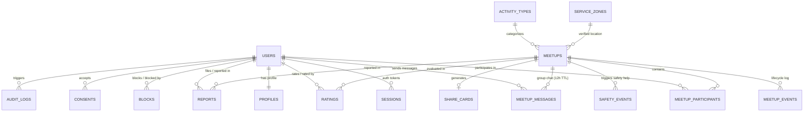

# NOW / IRL — Database Schema Specification (PostgreSQL + Drizzle ORM)

**Версия документа:** 2.0.0 (Phase 0 — Group Meetup Schema)  
**Каноническая СУБД:** PostgreSQL 15+  
**ORM:** Drizzle ORM  

---

## 1. Entity-Relationship (ER) Diagram

---

## 2. Список перечислений (Enums)

1. `user_role`: `'user'`, `'moderator'`, `'admin'`
2. `user_status`: `'active'`, `'suspended'`, `'deleted'`
3. `moderation_status`: `'pending'`, `'approved'`, `'rejected'`
4. `meetup_status`:
   - `'draft'`
   - `'scheduled'`
   - `'gathering'`
   - `'active'`
   - `'completed'`
   - `'cancelled_by_creator'`
   - `'cancelled_by_system'`
   - `'safety_review'`
   - `'archived'`
5. `participant_role`: `'creator'`, `'participant'`
6. `participant_status`: `'invited'`, `'joined'`, `'checked_in'`, `'left'`, `'removed'`, `'reported'`
7. `report_priority`: `'p0_emergency'`, `'p1_high'`, `'p2_medium'`, `'p3_low'`
8. `report_category`: `'sexual_solicitation'`, `'private_place_solicitation'`, `'aggression_or_threats'`, `'drugs_or_weapons'`, `'no_show_spam'`, `'inappropriate_behavior'`, `'other'`

---

## 3. Таблицы новой доменной модели (19 таблиц)

1. **`users`:** `id` (uuid, PK), `phone_lookup_hash` (text, NOT NULL, UNIQUE, HMAC-SHA256), `role` (user_role), `status` (user_status), `age_confirmed_at` (timestamptz), `created_at`, `updated_at`, `deleted_at`.
2. **`sessions`:** `id` (uuid, PK), `user_id` (FK -> `users.id` CASCADE), `token_hash` (text, UNIQUE), `expires_at`, `revoked_at`, `created_at`.
3. **`profiles`:** `user_id` (uuid, PK, FK -> `users.id` CASCADE), `display_name` (text), `bio` (text), `age_band` (text, '18-21', '22-25', '26-30', '31+'), `avatar_ref` (text), `is_demo` (boolean, default false), `show_reliability_badge` (boolean, default true), `reliability_score` (integer, default 100), `created_at`, `updated_at`.
4. **`interests`:** `id` (text, PK, slug), `name` (text), `category` (text).
5. **`activity_types`:** `id` (text, PK, e.g. 'football', 'coffee', 'walk'), `title` (text), `icon` (text), `default_duration_minutes` (integer), `default_capacity` (integer), `is_active` (boolean, default true).
6. **`service_zones`:** `id` (text, PK, 'DEMO_PUBLIC_ZONE_1..3'), `city` (text), `name` (text), `description` (text), `approximate_lat` (numeric(10,6)), `approximate_lng` (numeric(10,6)), `public_place_required` (boolean, default true), `is_whitelisted` (boolean, default true).
7. **`meetups`:** `id` (uuid, PK), `creator_id` (FK -> `users.id` RESTRICT), `activity_type_id` (FK -> `activity_types.id`), `zone_id` (FK -> `service_zones.id`), `approximate_lat` (numeric(10,6), NULL), `approximate_lng` (numeric(10,6), NULL), `public_place_name` (text), `starts_at` (timestamptz), `duration_minutes` (integer, default 60), `capacity` (integer, default 4), `status` (meetup_status, default 'gathering'), `safe_description` (text), `created_at`, `updated_at`.
8. **`meetup_participants`:** `id` (uuid, PK), `meetup_id` (FK -> `meetups.id` CASCADE), `user_id` (FK -> `users.id` CASCADE), `role` (participant_role, default 'participant'), `status` (participant_status, default 'joined'), `joined_at` (timestamptz, default now()), `checked_in_at` (timestamptz), `left_at` (timestamptz).
9. **`meetup_events`:** `id` (uuid, PK), `meetup_id` (FK -> `meetups.id` CASCADE), `actor_id` (FK -> `users.id`), `event_type` (text), `redacted_payload` (jsonb), `created_at`.
10. **`meetup_messages`:** `id` (uuid, PK), `meetup_id` (FK -> `meetups.id` CASCADE), `sender_id` (FK -> `users.id`), `body` (text), `moderation_status` (moderation_status, default 'approved'), `retention_expires_at` (timestamptz), `created_at`, `deleted_at`.
11. **`ratings`:** `id` (uuid, PK), `meetup_id` (FK -> `meetups.id` CASCADE), `author_id` (FK -> `users.id`), `target_id` (FK -> `users.id`), `showed_up` (boolean), `on_time` (boolean), `respectful` (boolean), `would_join_again` (boolean), `status` (moderation_status, default 'approved'), `created_at`.
12. **`reports`:** `id` (uuid, PK), `meetup_id` (FK -> `meetups.id`), `reporter_id` (FK -> `users.id`), `target_id` (FK -> `users.id`), `category` (report_category), `description` (text), `priority` (report_priority, default 'p2_medium'), `status` (text, default 'pending'), `moderator_id` (FK -> `users.id`), `created_at`, `resolved_at`.
13. **`blocks`:** `id` (uuid, PK), `blocker_id` (FK -> `users.id` CASCADE), `blocked_id` (FK -> `users.id` CASCADE), `reason` (text), `created_at`.
14. **`safety_events`:** `id` (uuid, PK), `meetup_id` (FK -> `meetups.id`), `reporter_id` (FK -> `users.id`), `event_type` (text, default 'safety_help'), `approximate_location` (jsonb), `status` (text, default 'triggered'), `created_at`.
15. **`consents`:** `id` (uuid, PK), `user_id` (FK -> `users.id` CASCADE), `consent_type` (text), `document_version` (text), `text_hash` (text), `accepted_at`, `withdrawn_at`.
16. **`notifications`:** `id` (uuid, PK), `user_id` (FK -> `users.id` CASCADE), `title` (text), `body` (text), `is_read` (boolean, default false), `metadata` (jsonb), `created_at`.
17. **`audit_logs`:** `id` (uuid, PK), `actor_id` (FK -> `users.id`), `action` (text), `resource_type` (text), `resource_id` (text), `correlation_id` (text), `redacted_diff` (jsonb), `created_at`.
18. **`feature_flags`:** `key` (text, PK), `description` (text), `enabled` (boolean, default false), `rules` (jsonb), `updated_at`.
19. **`share_cards`:** `id` (uuid, PK), `meetup_id` (FK -> `meetups.id` CASCADE), `card_data` (jsonb), `image_url` (text), `created_at`.

---

## 4. Индексы и Check Constraints

- **Уникальные составные индексы:**
  - `meetup_participants_unique_idx`: `UNIQUE(meetup_id, user_id)` (один пользователь не может вступить дважды);
  - `ratings_unique_idx`: `UNIQUE(meetup_id, author_id, target_id)` (ровно одна оценка на пару за митап);
  - `blocks_pair_idx`: `UNIQUE(blocker_id, blocked_id)`.
- **Составные индексы производительности:**
  - `meetups_status_zone_idx`: `(status, zone_id, starts_at)` (для ленты «Огоньков»);
  - `meetup_messages_retention_idx`: `(meetup_id, retention_expires_at)` (для фонового 12-часового purge);
  - `reports_priority_status_idx`: `(status, priority)`.
- **Check Constraints:**
  - `meetups_capacity_range`: `CHECK (capacity >= 2 AND capacity <= 12)`;
  - `meetups_duration_valid`: `CHECK (duration_minutes >= 15 AND duration_minutes <= 240)`;
  - `ratings_prevent_self`: `CHECK (author_id <> target_id)`;
  - `blocks_prevent_self`: `CHECK (blocker_id <> blocked_id)`.
