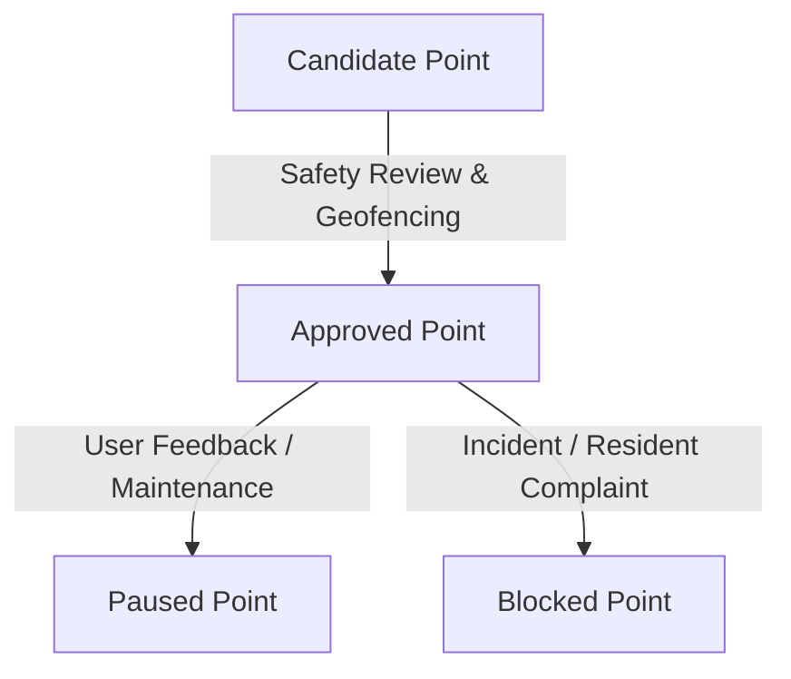

# Map & Location Services Roadmap

## Strategic Vision
NOW / IRL enables spontaneous offline group meetups without compromising user privacy. The application strictly forbids:
- Real-time continuous background GPS tracking;
- Arbitrary private or home address pin-drops;
- Transmitting precise coordinates to unverified third parties.

---

## 1. Web Map Engine: MapLibre GL JS
- **Candidate:** [MapLibre GL JS](https://maplibre.org/) (open-source fork of Mapbox GL v1).
- **Rationale:** High performance, vector tiles rendering via WebGL/WebGPU, zero proprietary SDK lock-in, customizable dark theme matching NOW / IRL design aesthetics.
- **Tiles Strategy:** Self-hosted vector tiles (e.g., Planetiler / OpenMapTiles) or trusted privacy-conscious tile providers (Protomaps, Stadia Maps, Jawg).

---

## 2. OpenStreetMap Attribution & ODbL Compliance
- All map renderings leveraging OpenStreetMap data will display proper attribution:  
  *© OpenStreetMap contributors*.
- Data licensing complies with the Open Database License (ODbL).
- Custom user-generated annotations (such as meetups and flame statuses) remain in application domain storage and are not mingled with ODbL derivative databases.

---

## 3. Curated Public Place Catalog & Point Lifecycle
Users cannot drop pins on private residences, apartments, or unlit isolated alleys. Instead, activities occur only in pre-approved public zones and points:

### Point Lifecycle States:
1. **`candidate`**: Suggested public location (park, square, sports facility) undergoing automated and manual verification.
2. **`approved`**: Verified open public zone with street lighting and open visibility; available for meeting point selection.
3. **`paused`**: Temporarily closed (e.g. winter maintenance, seasonal renovation).
4. **`blocked`**: Removed permanently due to safety reports or private property restrictions.

---

## 4. Privacy & Selective Meeting Point Visibility
- **Before Join (Public Discovery):** Nearby users and anonymous discovery feeds **only see the zone name and distance band** (e.g., «Центральный парк • < 500 м»).
- **After Join (Confirmed Participants):** Once a verified user joins the meetup, the specific safe meeting point label is revealed (e.g., «Центральный парк — У фонтана»).

---

## 5. Navigation & Deep Links
- **Yandex Maps & 2GIS:** After joining, users may optionally open external route guidance via deep links (`yandexmaps://` / `dgis://`).
- **Zero Coordinate Hallucination:** Deep links are only generated when an approved point with verified coordinates exists. In prototype phases, links remain disabled with clear explanations.
- **OSRM (Open Source Routing Machine):** Evaluated strictly for calculating approximate walking distance and travel time intervals, never for rendering base maps.
